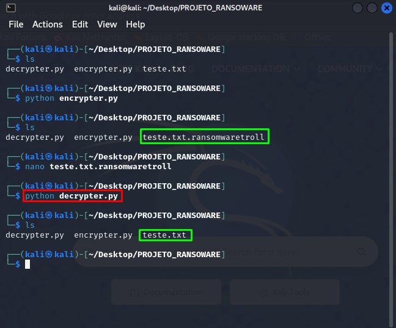

# BOOTCAMP SANTANDER DIO

## Criação de Ransomware

### Ferramentas
- Kali Linux
- Python
- Biblioteca Pyaes

### Instalação da biblioteca Pyaes

### Criação de ransomware utilizando python

### Criação do descriptador utilizando python

### Resultado do arquivo criptografado:

### Resultado do arquivo descriptografado:

